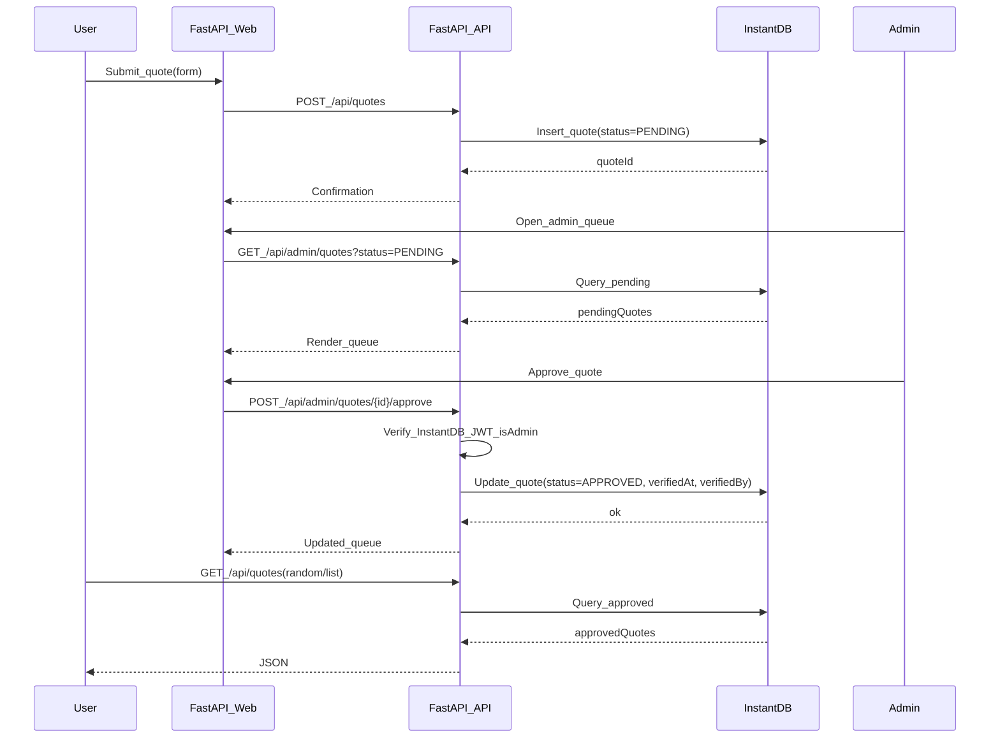

# Dan Quotes Service (FastAPI + InstantDB)

## Architecture

- **Backend**: FastAPI (Python) with server-rendered pages (Jinja2) + JSON API.
- **Database**: InstantDB (primary source of truth).
- **Auth**: InstantDB auth for admin-only actions (approve/reject/import).

## Data model (InstantDB)

- **Collection/Table**: `quotes`
  - `id` (string/uuid)
  - `content` (string)
  - `content_hash` (string; dedupe)
  - `status` (enum: `PENDING` | `APPROVED` | `REJECTED`)
  - `source` (string; e.g. `records.txt` or `web_submit`)
  - `created_at` (timestamp)
  - `submitted_by` (string; InstantDB user id/email if available)
  - `verified_at` (timestamp, nullable)
  - `verified_by` (string, nullable)

## Backend features

- **Public web pages**
  - `/` list approved quotes (pagination)
  - `/random` show one random approved quote
  - `/submit` form to submit a new quote
- **Admin web pages (InstantDB-authenticated)**
  - `/admin` pending queue (approve/reject)
  - Optional: `/admin/import` button to run import in dev (still keep script for reproducibility)

## API surface

- **Public**
  - `GET /api/quotes` (list approved; `limit`, `cursor`)
  - `GET /api/quotes/random`
  - `GET /api/quotes/{id}` (approved only)
  - `POST /api/quotes` (create pending)
- **Admin (requires InstantDB JWT + isAdmin)**
  - `GET /api/admin/quotes?status=PENDING`
  - `POST /api/admin/quotes/{id}/approve`
  - `POST /api/admin/quotes/{id}/reject`

## Auth + admin check

- Accept `Authorization: Bearer <instantdb_jwt>` on admin routes.
- Verify token using InstantDB’s published mechanism (JWKs / verify endpoint—implementation will follow InstantDB docs).
- Determine admin via a simple allowlist in env (e.g. `ADMIN_EMAILS=you@x.com,other@y.com`) based on claims from the verified token.

## Initial import (seed from records.txt)

- Add script [`scripts/import_records.py`](/Users/Qiao/Documents/cursor_local_folder/dans_bullshit/scripts/import_records.py) that:
  - Parses numbered bullet lines in [`records.txt`](/Users/Qiao/Documents/cursor_local_folder/dans_bullshit/records.txt).
  - Normalizes whitespace, computes `content_hash`.
  - Inserts into InstantDB as `APPROVED` with `source=records.txt`.
  - Skips duplicates by `content_hash`.

## Project structure to add

- [`app/main.py`](/Users/Qiao/Documents/cursor_local_folder/dans_bullshit/app/main.py) FastAPI app, routers, template wiring.
- [`app/instantdb.py`](/Users/Qiao/Documents/cursor_local_folder/dans_bullshit/app/instantdb.py) InstantDB client wrapper (CRUD + query helpers).
- [`app/auth.py`](/Users/Qiao/Documents/cursor_local_folder/dans_bullshit/app/auth.py) JWT verification + `is_admin()`.
- [`app/models.py`](/Users/Qiao/Documents/cursor_local_folder/dans_bullshit/app/models.py) Pydantic request/response models.
- [`app/templates/`](/Users/Qiao/Documents/cursor_local_folder/dans_bullshit/app/templates/) Jinja2 templates for pages.
- [`app/static/`](/Users/Qiao/Documents/cursor_local_folder/dans_bullshit/app/static/) minimal CSS.
- [`scripts/import_records.py`](/Users/Qiao/Documents/cursor_local_folder/dans_bullshit/scripts/import_records.py) seed importer.
- [`requirements.txt`](/Users/Qiao/Documents/cursor_local_folder/dans_bullshit/requirements.txt) pinned deps (fastapi, uvicorn, jinja2, httpx/requests, python-dotenv).
- [`README.md`](/Users/Qiao/Documents/cursor_local_folder/dans_bullshit/README.md) setup, env vars, run + import steps.

## Configuration (env vars)

- `INSTANTDB_APP_ID`
- `INSTANTDB_API_KEY` (server-side key if needed for admin operations)
- `INSTANTDB_BASE_URL` (if applicable)
- `INSTANTDB_JWKS_URL` or `INSTANTDB_TOKEN_VERIFY_URL` (depending on InstantDB’s auth verification method)
- `ADMIN_EMAILS`

## Acceptance criteria

- Can submit a quote → lands as **PENDING**.
- Admin can view queue and **APPROVE/REJECT**.
- Only **APPROVED** quotes appear on `/`, `/random`, and public API.
- One command/script imports the existing `records.txt` quotes into InstantDB as **APPROVED**.