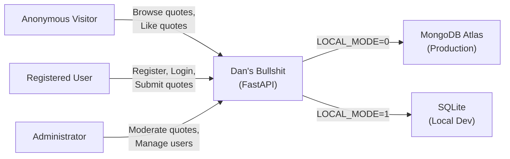
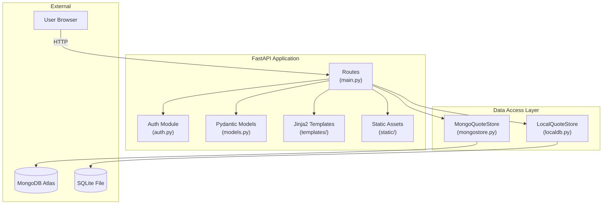
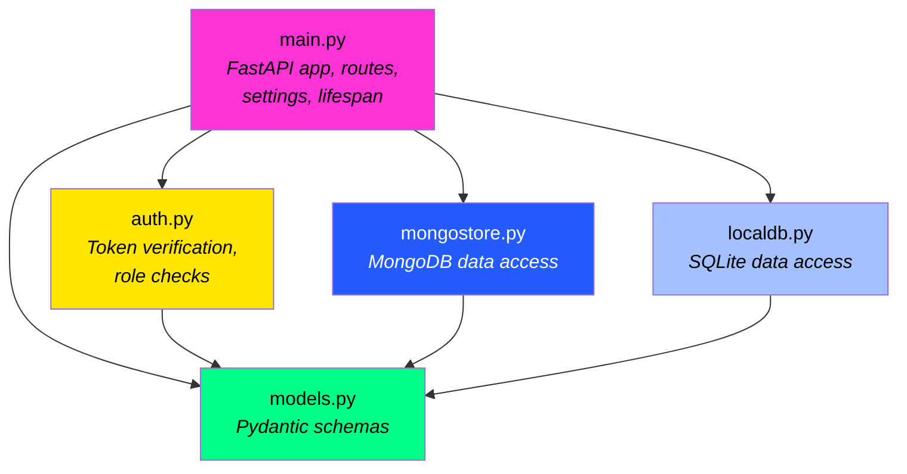
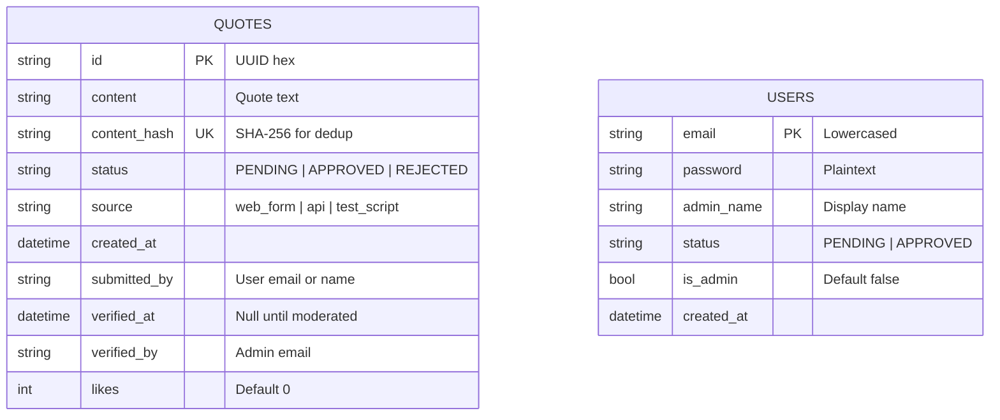

# Architecture Overview

## System Context (C4 Level 1)

The system has three actors: anonymous visitors, registered users, and administrators. All interact through a single FastAPI web server that talks to either MongoDB Atlas or a local SQLite file.



**Boundaries:**
- The app is a single-process Python server -- no microservices, no message queues, no background workers
- MongoDB Atlas is a managed cloud database; SQLite is an embedded file
- Authentication is self-contained (no OAuth provider, no third-party auth service)

## Container Architecture (C4 Level 2)



## Component Architecture (C4 Level 3)

### Module Dependency Graph



### Route Organization

Routes in `main.py` are organized into four sections:

| Section | Routes | Auth Required |
|---|---|---|
| **Web Pages** | `GET /`, `/submit`, `/register`, `/admin`, `/login`, `/error` | Varies |
| **Web Actions** | `POST /submit`, `/register`, `/admin/login`, `/admin/logout`, `/admin/update/{id}`, `/admin/approve/{id}`, `/admin/reject/{id}`, `/admin/resubmit/{id}`, `/admin/bulk-update`, `/admin/users/{email}/approve`, `/admin/users/{email}/reject` | Yes |
| **Public API** | `GET/POST /api/quotes`, `GET /api/quotes/random`, `GET /api/quotes/latest`, `GET /api/quotes/{id}`, `POST /api/quotes/{id}/like` | No (except POST create) |
| **Admin API** | `GET /api/admin/quotes`, `POST /api/admin/quotes/{id}/approve`, `POST /api/admin/quotes/{id}/reject` | Admin only |

## Architectural Patterns

### 1. Duck-Typed Database Abstraction

The two store classes (`MongoQuoteStore` and `LocalQuoteStore`) are not related by inheritance or an abstract base class. Instead, they implement the same set of async methods by convention:

```python
QuoteStore = MongoQuoteStore | LocalQuoteStore  # Union type alias
```

Both implement: `create_quote()`, `get_quote()`, `list_quotes()`, `update_quote()`, `update_status()`, `random_approved()`, `latest_quote()`, `increment_likes()`, `bulk_update_status()`, `content_hash()`, `create_user()`, `get_user_by_email()`, `list_users()`, `update_user_status()`, `delete_user()`, `set_user_admin()`, `get_admin_by_email()`.

The active store is selected at startup in the `lifespan()` function and attached to `app.state.db_client`.

### 2. Settings as Pydantic Model

Environment variables are parsed into a `Settings` Pydantic model with `Field(alias=...)` mapping:

```python
class Settings(BaseModel):
    local_mode: bool = Field(default=False, alias="LOCAL_MODE")
    mongodb_uri: Optional[str] = Field(default=None, alias="MONGODB_URI")
    # ...
```

The model is cached with `@lru_cache(maxsize=1)` so `.env` is only parsed once.

### 3. Cookie-Encoded Authentication

Rather than using session storage or JWTs for local mode, the app encodes credentials directly into the cookie value as `email:password:role`. The `verify_token()` function in `auth.py` parses this format and validates against both `.env` admin credentials and the database user table.

### 4. Lifespan-Based Initialization

FastAPI's `lifespan` context manager handles:
- Database client creation (Mongo or SQLite)
- Auto-creating `.env`-defined admin accounts in local mode
- Clean shutdown of MongoDB connections

### 5. Content Deduplication

Every quote gets a SHA-256 hash of its content stored as `content_hash`. A unique index on this field prevents duplicate submissions at the database level.

## Data Model



**Key relationships:**
- `quotes.submitted_by` references a user's display name (not email -- it's a denormalized string)
- `quotes.verified_by` stores the admin's email who approved/rejected
- Users and quotes are not foreign-key linked; the relationship is loose

## Key Design Decisions

### 1. Server-Rendered vs SPA
- **Decision**: Server-rendered Jinja2 templates with sprinkled JavaScript
- **Rationale**: Simplicity. The app has a small surface area -- a few pages, a shuffle button, a like button. A full SPA framework would be overkill.
- **Trade-off**: The inline `<script>` blocks in templates are harder to test and grow unwieldy if the JS surface area increases.

### 2. Dual Database Mode
- **Decision**: SQLite for local development, MongoDB for production, selected by `LOCAL_MODE` env var
- **Rationale**: Zero-config local development (no Mongo install required) while keeping the production database cloud-managed
- **Trade-off**: Two implementations to maintain. Features must be added to both stores. Duck typing means no compiler-level guarantee they stay in sync.

### 3. No Password Hashing
- **Decision**: Passwords are stored as plaintext in both databases
- **Rationale**: This is a friends-only fun project, not a banking app. The authentication is minimal by design.
- **Trade-off**: Insecure. If the database is compromised, all passwords are exposed.

### 4. Cookie-Encoded Credentials
- **Decision**: The auth cookie contains `email:password:role` in plaintext
- **Rationale**: Avoids the need for server-side sessions or a token store
- **Trade-off**: If `httponly` and `secure` flags are ever misconfigured, credentials leak. The cookie value is effectively a bearer token.

## Module Breakdown

### main.py (712 lines)
- **Purpose**: Application entry point. Defines all routes, settings, lifespan, error handlers, and template configuration.
- **Key Components**: `Settings` model, `lifespan()` startup, 25+ route handlers, `format_datetime` template filter
- **Dependencies**: All other app modules

### auth.py (210 lines)
- **Purpose**: Authentication and authorization. Token verification, admin/user role checks.
- **Key Components**: `AdminContext` (auth result), `AuthSettings`, `verify_token()`, `get_current_admin()`, `get_current_user()`
- **Dependencies**: `models.py`, PyJWT

### models.py (66 lines)
- **Purpose**: Pydantic data models shared by all modules.
- **Key Components**: `QuoteResponse`, `QuoteCreate`, `QuoteListResponse`, `User`, `UserStatus`, `QuoteStatus`
- **Dependencies**: None (leaf module)

### mongostore.py (364 lines)
- **Purpose**: MongoDB data access using Motor (async pymongo).
- **Key Components**: `MongoQuoteStore`, `MongoConfig`, `MongoDBError`
- **Dependencies**: `models.py`, Motor, pymongo

### localdb.py (483 lines)
- **Purpose**: SQLite data access with full feature parity to MongoDB store.
- **Key Components**: `LocalQuoteStore`, `LocalDBConfig`, `LocalDBError`
- **Dependencies**: `models.py`, stdlib sqlite3
