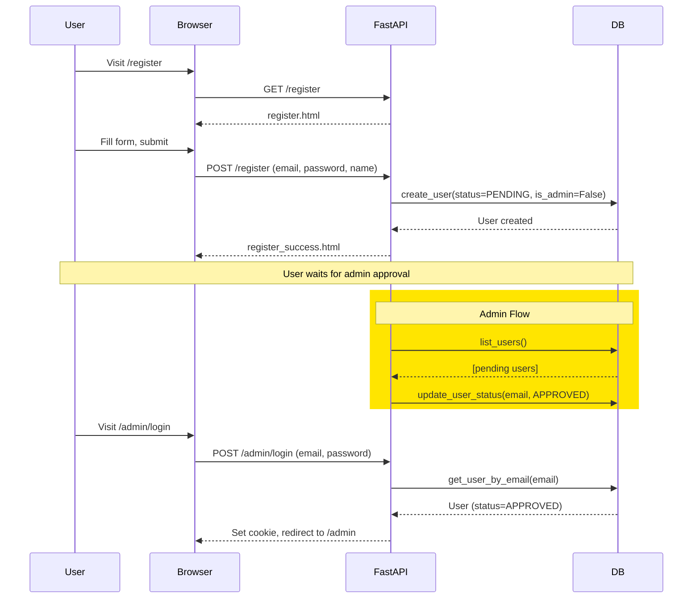
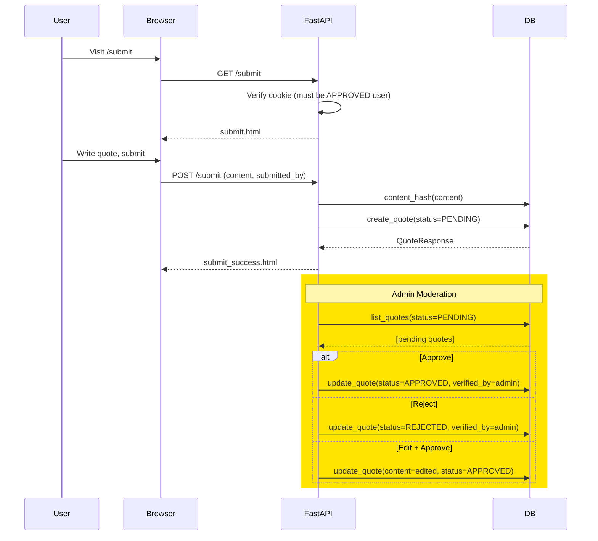
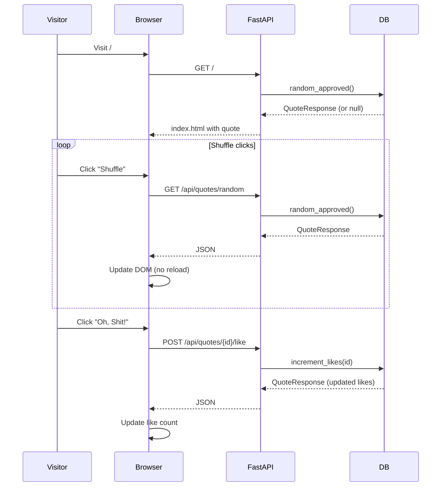
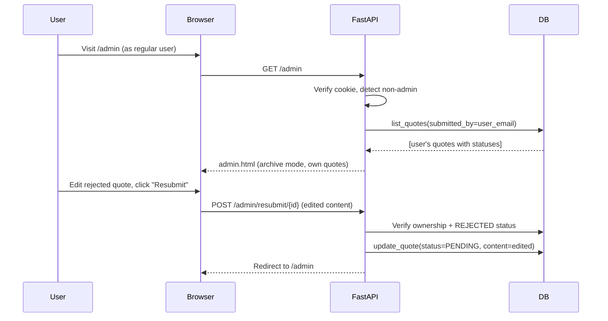
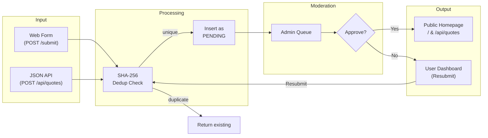
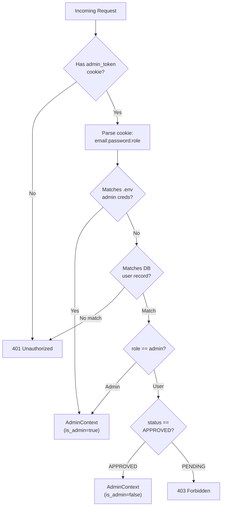

# Workflow Overview

## Core Workflows

### Workflow 1: User Registration & Approval

A new user must register, wait for admin approval, then log in to access the submission form.

**Steps:**
1. User fills out registration form (name, email, password)
2. Server creates user record with `status=PENDING`
3. Admin logs in, navigates to user moderation (`/admin?mode=users`)
4. Admin clicks "Approve" on the pending user
5. User can now log in and access the submission form

### Workflow 2: Quote Submission & Moderation

An approved user submits a quote, which enters the pending queue for admin review.

**Steps:**
1. Authenticated user visits `/submit` (redirects to login if no cookie)
2. User fills in quote content and submitter name
3. Server computes SHA-256 hash, checks for duplicates, inserts with `status=PENDING`
4. Admin sees quote in moderation queue (`/admin?mode=moderation`)
5. Admin can: approve, reject, edit content, edit submitter, or use bulk approve/reject all

### Workflow 3: Quote Dispensing (Homepage)

The homepage shows one random approved quote with shuffle and like functionality, all via AJAX.

**Key details:**
- Initial page load is server-rendered (SEO-friendly, works without JS)
- Subsequent shuffles use `fetch()` to the JSON API -- no page reload
- Like button is unauthenticated -- anyone can click it (no rate limiting)
- Font size dynamically scales to fit the quote container (`fitQuoteToContainer()`)

### Workflow 4: Rejected Quote Resubmission

Regular users can see their own submission history and resubmit rejected quotes.

## Data Flow

## Authentication Flow

**Notes:**
- `.env` admins always take priority (checked first)
- Database users are checked second
- The `AdminContext` object is used everywhere despite the name -- it represents any authenticated user
- `get_current_admin()` requires `is_admin=True`; `get_current_user()` allows both roles but requires `status=APPROVED`

## State Management

The application is stateless from the server's perspective:

- **No server-side sessions** -- all auth state lives in the cookie
- **No in-memory cache** -- every request hits the database
- **Settings cached once** -- `get_settings()` is `@lru_cache(maxsize=1)`, parsed from `.env` at first call
- **Database connection** -- stored on `app.state.db_client`, created during lifespan startup

## Error Handling

| Layer | Strategy |
|---|---|
| **HTTP 404/500** | Global exception handlers redirect to `/error` page |
| **Database errors** | `MongoDBError` / `LocalDBError` caught in every route, converted to HTTP 502 |
| **Auth failures** | `HTTPException(401)` or `HTTPException(403)` raised, web routes redirect to login |
| **Duplicate content** | Silently returns existing quote (no error) |
| **Validation** | Pydantic handles request validation; FastAPI returns 422 automatically |
| **Local vs Prod error detail** | Local mode shows full error message; production says "Internal database error" |
