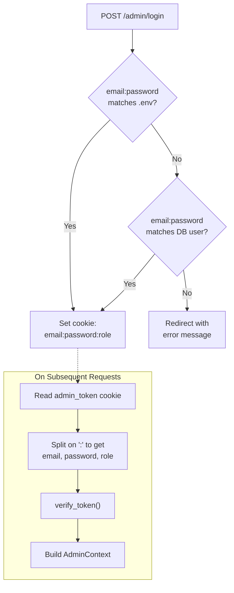

# Deep Dive: Authentication & Authorization

## Overview

The auth system handles two classes of users -- administrators (defined in `.env` or flagged in the database) and regular registered users. Authentication is cookie-based: a successful login sets an HTTP-only cookie containing encoded credentials, and every subsequent request decodes that cookie to determine the user's identity and role.

## Responsibilities

- Verify login credentials against `.env` admin list and database users
- Issue and parse auth cookies in `email:password:role` format
- Enforce role-based access (admin-only routes vs user routes)
- Block pending (unapproved) users from accessing protected resources
- Support JWT verification via JWKS (production path, currently unused)

## Architecture



## Key Files

- **`app/auth.py`** (210 lines): Core auth logic
- **`app/main.py`** lines 375-423: Login route that sets the cookie
- **`app/main.py`** lines 426-438: `get_admin()` dependency wrapper
- **`app/main.py`** lines 180-193: `get_user()` dependency wrapper

## Key Components

### AdminContext

The result of successful authentication. Despite the "Admin" name, it represents any authenticated user:

```python
class AdminContext:
    email: str        # User's email
    token: str        # Raw cookie/token value
    claims: dict      # Decoded claims (email, name, is_admin, status)
    name: str         # Display name (falls back to email prefix)
    is_admin: bool    # Whether user has admin privileges
    status: str       # "APPROVED" or "PENDING"
```

### AuthSettings

Configuration object built from environment variables:

```python
class AuthSettings:
    jwks_url: Optional[str]     # For JWT verification (currently None)
    admin_emails: List[str]     # From ADMIN_EMAILS env var
    local_mode: bool            # From LOCAL_MODE env var
    admin_password: Optional[str] # From ADMIN_PASSWORD env var
    admin_name: str             # From ADMIN_NAME env var
```

### verify_token()

The central authentication function. Handles multiple token formats:

```
Token formats:
  "email:password:admin"  -> .env admin or DB admin
  "email:password:user"   -> DB regular user
  "password:role"          -> Legacy/simple format
  "raw_jwt"                -> JWT verification (JWKS path)
```

**Verification priority:**
1. Parse `:` delimiters to extract email, password, role
2. Check against `.env` admin credentials (`ADMIN_CREDENTIALS` or `ADMIN_EMAILS` + `ADMIN_PASSWORD`)
3. Check against database user records
4. Attempt JWT verification via JWKS (if `jwks_url` is configured)
5. Raise 401 if nothing matches

### get_current_admin() vs get_current_user()

Two FastAPI dependencies that wrap `verify_token()`:

| Function | Requires admin? | Requires approved? | Used by |
|---|---|---|---|
| `get_current_admin()` | Yes (403 if not) | No | Admin moderation routes |
| `get_current_user()` | No | Yes for non-admins (403 if pending) | Quote submission, user dashboard |

## Cookie Format

The auth cookie (`admin_token`) contains:

```
{email}:{password}:{role}
```

Example: `dan@example.com:mypassword123:admin`

**Cookie settings:**
- `httponly=True` -- not accessible via JavaScript
- `samesite="lax"` -- sent with top-level navigations
- `secure=not settings.local_mode` -- HTTPS-only in production, HTTP allowed locally

## Admin Credential Resolution

The system supports multiple ways to define admin credentials in `.env`:

```env
# Option 1: Single admin, single password
ADMIN_EMAILS=admin@example.com
ADMIN_PASSWORD=secret

# Option 2: Multiple admins, one password each
ADMIN_EMAILS=admin1@example.com,admin2@example.com
ADMIN_PASSWORD=secret1,secret2

# Option 3: Explicit credential pairs
ADMIN_CREDENTIALS=admin1@example.com:secret1,admin2@example.com:secret2
```

The `admin_creds` property on `Settings` resolves these into a `dict[str, str]` mapping emails to passwords. `ADMIN_CREDENTIALS` takes priority if set.

## Security Considerations

| Concern | Status | Notes |
|---|---|---|
| Password hashing | Not implemented | Passwords stored and compared in plaintext |
| Cookie encryption | Not implemented | Credentials visible in cookie value (mitigated by httponly) |
| CSRF protection | Not implemented | POST forms have no CSRF tokens |
| Rate limiting | Not implemented | Login and like endpoints have no throttling |
| Session expiry | Not implemented | Cookies have no explicit expiration |
| JWT support | Partially implemented | JWKS path exists but `jwks_url` is always None in current config |

These are acceptable trade-offs for a small friends-only application but would need addressing if the app were to handle sensitive data or a larger user base.

## Login Flow Details

1. User submits email + password to `POST /admin/login`
2. Server checks `.env` admin credentials first
3. If no match, queries database for user by email
4. If user found and password matches, determines role (`admin` if `is_admin=True`, else `user`)
5. Constructs cookie value as `email:password:role`
6. Sets `admin_token` cookie with appropriate security flags
7. Redirects to `/admin`
8. On failure, redirects back to `/admin/login?error=ERROR+MESSAGE`
