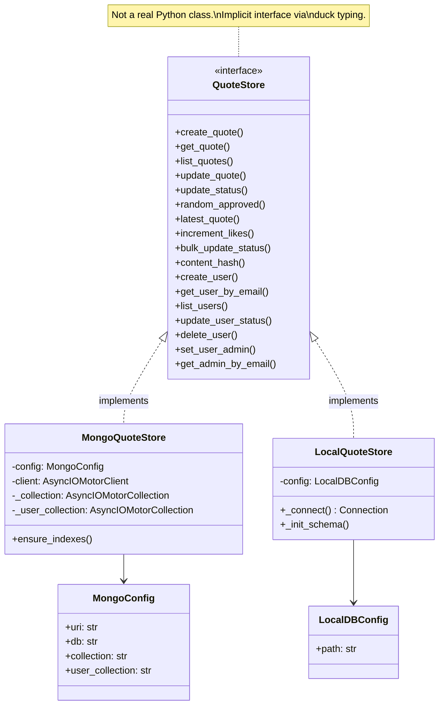

# Deep Dive: Database Layer

## Overview

The database layer is split into two parallel implementations that share the same interface: `MongoQuoteStore` (production, using MongoDB Atlas via the async Motor driver) and `LocalQuoteStore` (development, using synchronous SQLite wrapped in async methods). The active store is chosen at startup based on the `LOCAL_MODE` environment variable and injected into routes via FastAPI's dependency system.

## Responsibilities

- CRUD operations for quotes (create, read, update, list, random, latest)
- CRUD operations for users (create, read, list, update status, delete, admin management)
- Content deduplication via SHA-256 hashing
- Like count management
- Bulk status updates for moderation
- Schema initialization and migration (SQLite only)

## Architecture



**Note:** `QuoteStore` is not an actual Python abstract class. It's a `Union` type alias (`MongoQuoteStore | LocalQuoteStore`). The two stores implement the same methods by convention, not by inheritance.

## Key Files

- **`app/mongostore.py`** (364 lines): Production MongoDB implementation
- **`app/localdb.py`** (483 lines): Development SQLite implementation
- **`app/models.py`** (66 lines): Shared Pydantic models consumed by both stores

## Implementation Details

### MongoDB Store

**Connection:** Uses Motor's `AsyncIOMotorClient`, created during app lifespan and closed on shutdown. The client is passed into the constructor -- the store doesn't manage its own connection lifecycle.

**Collections:** Two collections in the `dans-bullshit` database:
- `quotes` -- quote documents with `_id` set to a UUID hex string
- `users` -- unified user collection (both admins and regular users)

**Indexes:** Defined in `ensure_indexes()` but not called during startup (skipped for speed):
- `content_hash` -- unique, sparse (deduplication)
- `status` -- for filtering
- `(created_at, id)` -- for sorted listing
- `email` -- unique on users

**Key patterns:**
- `find_one_and_update` with `ReturnDocument.AFTER` for atomic update-and-return
- `$inc` operator for atomic like increments
- `$sample` aggregation for random quote selection
- Offset-based pagination (not cursor-based despite the `cursor` parameter name)

### SQLite Store

**Connection:** Creates a new `sqlite3.Connection` per operation via `_connect()`. No connection pooling. Uses `Row` factory for dict-like access.

**Schema:** Auto-created on first instantiation in `_init_schema()`. Includes a migration check for the `likes` column (added after initial release).

**Tables:**
```sql
CREATE TABLE quotes (
    id TEXT PRIMARY KEY,
    content TEXT NOT NULL,
    content_hash TEXT,
    status TEXT NOT NULL,
    source TEXT,
    created_at TEXT,    -- ISO 8601 string
    submitted_by TEXT,
    verified_at TEXT,
    verified_by TEXT,
    likes INTEGER DEFAULT 0
);

CREATE TABLE users (
    email TEXT PRIMARY KEY,
    password TEXT NOT NULL,
    admin_name TEXT,
    status TEXT NOT NULL,
    is_admin INTEGER DEFAULT 0,
    created_at TEXT
);
```

**Key patterns:**
- All methods are `async def` but call synchronous sqlite3 internally (fine for development use)
- `ORDER BY RANDOM() LIMIT 1` for random quote (simpler than Mongo's `$sample`)
- String-based ISO timestamps (not native datetime)
- Dynamic SQL construction with parameterized queries in `list_quotes()` and `update_quote()`

### Differences Between Stores

| Aspect | MongoDB | SQLite |
|---|---|---|
| Random selection | `$sample` aggregation | `ORDER BY RANDOM()` |
| Atomic operations | `find_one_and_update` | Separate UPDATE + SELECT |
| Likes increment | `$inc` operator | `COALESCE(likes, 0) + 1` |
| Date storage | Native datetime / ISO string | ISO string |
| Connection model | Persistent client | Per-operation connection |
| Admin exclusion in user list | `{"is_admin": {"$ne": True}}` | `WHERE is_admin = 0` |
| Schema setup | Manual `ensure_indexes()` | Auto in `_init_schema()` |

### Content Hashing

Both stores use the same static method:

```python
@staticmethod
def content_hash(content: str) -> str:
    return hashlib.sha256(content.strip().encode("utf-8")).hexdigest()
```

The hash is computed on stripped content, so leading/trailing whitespace doesn't create false duplicates. When a duplicate is detected during `create_quote()`, the existing quote is returned silently (no error, no duplicate entry).

## Dependencies

- **Internal**: `models.py` (Pydantic schemas)
- **External (MongoDB)**: `motor`, `pymongo`
- **External (SQLite)**: Python stdlib `sqlite3`, `uuid`, `hashlib`

## Data Integrity Notes

- **No foreign keys** between quotes and users -- `submitted_by` is a freeform string
- **No password hashing** -- passwords stored in plaintext
- **No transactions** in the SQLite store -- update + select could theoretically race (unlikely in single-user dev mode)
- **No connection pooling** for SQLite -- acceptable for development workloads
- **Offset pagination** in both stores -- can skip items if data changes between pages (a known limitation of offset-based pagination)
