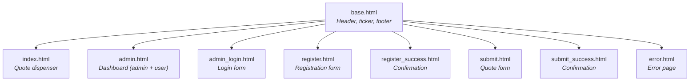
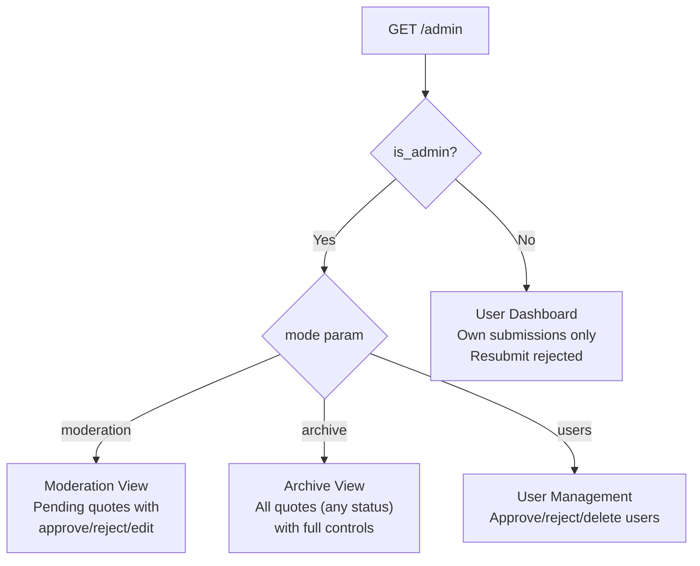

# Deep Dive: Frontend & UI

## Overview

The frontend is entirely server-rendered using Jinja2 templates with a distinctive brutalist/neo-magazine visual style. Interactive features (quote shuffling, likes) are powered by vanilla JavaScript `fetch()` calls to the JSON API. The design is mobile-first with extensive iPhone-specific optimizations.

## Responsibilities

- Render all user-facing pages (homepage, registration, login, submission, admin dashboard, error)
- Handle AJAX interactions (shuffle, like) without page reloads
- Provide a responsive, mobile-first experience
- Support iPhone safe areas (notch, Dynamic Island, home indicator)

## Template Hierarchy



All templates extend `base.html` via `` and inject content into ``.

## Key Files

- **`app/templates/base.html`** (78 lines): Layout shell with header, scrolling ticker, and footer
- **`app/templates/index.html`** (260 lines): Homepage with quote poster, shuffle/like JS, donate modal
- **`app/templates/admin.html`** (127 lines): Multi-mode dashboard (moderation, archive, users, user history)
- **`app/static/style.css`** (1321 lines): Brutalist stylesheet with extensive mobile media queries

## Design System

### Visual Identity

The UI uses a **brutalist/neo-magazine** aesthetic:

- **Heavy black borders** (5-7px solid) on all elements
- **Hard drop shadows** (`12px 12px 0` offset, no blur)
- **Bold typography** (weights 800-950, uppercase transforms)
- **Vivid color palette** with no gradients (except Instagram hover)
- **No border-radius** anywhere -- everything is sharp rectangles

### Color Palette

| Variable | Hex | Usage |
|---|---|---|
| `--bg` | `#f6f2ff` | Page background (light purple) |
| `--paper` | `#ffffff` | Card backgrounds |
| `--ink` | `#0b0b10` | Text, borders |
| `--sun` | `#ffe500` | Header, accent highlights |
| `--acid` | `#00ff85` | Success, approve buttons, approved badges |
| `--pink` | `#ff33d6` | Logo, hero section, like button |
| `--blue` | `#245bff` | Violet pill variant |
| `--hot` | `#ff2d2d` | Danger, reject, pending badges |

### Component Library

| Component | CSS Class | Description |
|---|---|---|
| Card | `.card` | Bordered white box with shadow |
| Button | `.btn`, `.btn.primary`, `.btn.danger`, `.btn.alt` | Touch-optimized (min 44px) |
| Pill | `.pill`, `.pill.hot`, `.pill.acid` | Status badge labels |
| Badge | `.badge`, `.badge.alt` | Navigation tabs in admin |
| Poster | `.poster` | Fixed-height quote display container |
| Ticker | `.ticker` | Scrolling marquee bar |
| Modal | `.modal` | Fullscreen overlay (donate QR) |

## Mobile Optimizations

The CSS is mobile-first with three breakpoints:

| Breakpoint | Target |
|---|---|
| `max-width: 820px` | Tablet -- cards go full-width, poster auto-height |
| `max-width: 600px` | Phone -- single column, hidden hero image, compact controls |
| `max-width: 380px` | Small phone -- tighter padding, smaller fonts |

### iPhone-Specific Features

```css
/* Safe area support for notch/Dynamic Island */
--safe-top: env(safe-area-inset-top, 0px);
--safe-bottom: env(safe-area-inset-bottom, 0px);

/* Prevent iOS text size adjustment */
-webkit-text-size-adjust: 100%;

/* Font size >= 16px prevents iOS auto-zoom on focus */
font-size: 16px;

/* Remove iOS default form styling */
-webkit-appearance: none;
border-radius: 0;
```

- Header accounts for Dynamic Island via `padding-top: var(--safe-top)`
- Footer accounts for home indicator via `padding-bottom: var(--safe-bottom)`
- Modal respects all four safe areas
- Touch targets are minimum 44px (Apple HIG recommendation)
- Header is non-sticky on mobile to save screen space

## JavaScript Interactions

All JS is inline in templates (no build step, no bundler).

### Quote Shuffle (`index.html`)

```
Click "Shuffle" → fetch('/api/quotes/random') → Update DOM
```

- Disables button during fetch, shows "Loading..."
- Updates `<blockquote>` text, `data-quote-id` attribute, and like count
- Calls `fitQuoteToContainer()` to dynamically resize font
- Creates elements if they don't exist (handles empty-state to quote-state transition)

### Dynamic Font Sizing (`index.html`)

```javascript
function fitQuoteToContainer() {
    // Start at max font size
    // Shrink until scrollHeight <= clientHeight
    // Mobile: 20px max, 12px min
    // Desktop: 48px max, 14px min
}
```

Runs on load and on window resize. Ensures long quotes don't overflow the fixed-height poster.

### Like Button (`index.html`)

```
Click "Oh, Shit!" → POST /api/quotes/{id}/like → Update counter
```

- No authentication required
- No rate limiting
- Updates the count display after each successful response

### Donate Modal (`index.html`)

Standard modal pattern: button opens overlay, close button or background click dismisses it. Displays a QR code image.

## Admin Dashboard Modes

The `admin.html` template renders four different views based on `mode` and `is_admin`:



### Moderation View (admin only)
- Shows only `PENDING` quotes
- Bulk actions bar: "Approve All" / "Reject All"
- Per-quote: editable textarea, editable submitter, Approve/Reject/Edit buttons

### Archive View (admin only)
- Shows all quotes regardless of status
- Color-coded pills: red for PENDING, green for APPROVED
- Full edit controls on each quote

### User Management (admin only)
- Lists non-admin users
- Shows status pill and join date
- Approve/Delete buttons per user

### User Dashboard (regular users)
- Shows only the logged-in user's own quotes
- Read-only for approved/pending quotes
- Rejected quotes become editable with a "Resubmit" button

## Template Variables

Key variables passed from routes to templates:

| Template | Variables |
|---|---|
| `index.html` | `quote` (random QuoteResponse or None) |
| `admin.html` | `quotes`, `users`, `admin_name`, `admin_email`, `is_admin`, `mode` |
| `submit.html` | `user` (AdminContext) |
| `admin_login.html` | `local_mode`, `error` (optional error string) |
| `base.html` | `settings` (globally injected via `templates.env.globals`) |

## Custom Template Filter

```python
templates.env.filters["format_datetime"] = format_datetime
```

Converts ISO datetime strings or datetime objects to `YYYY-MM-DD HH:MM` format. Used in admin dashboard to display quote and user timestamps.
