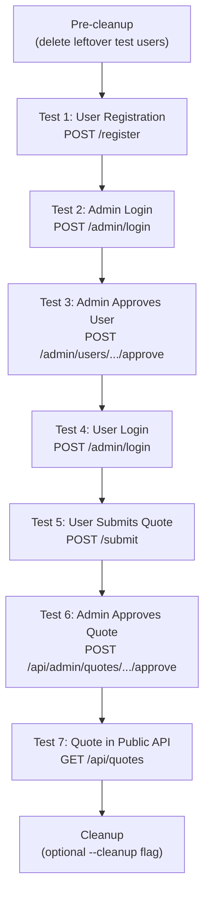

# Deep Dive: Scripts & Testing

## Overview

The project includes four utility scripts in the `scripts/` directory. These are standalone Python scripts meant to be run manually for testing, debugging, and operational tasks. There is no automated test suite -- the E2E test script serves as the primary verification tool.

## Key Files

- **`scripts/test_user_flow.py`** (441 lines): Comprehensive end-to-end test
- **`scripts/check_prod_users.py`**: List users from MongoDB production database
- **`scripts/compare_dbs.py`**: Compare data between MongoDB and SQLite
- **`scripts/reset_likes.py`**: Reset all like counters to zero

## test_user_flow.py

The most substantial script. Simulates the complete user lifecycle by making HTTP requests against a running server.

### Test Sequence



### How It Works

1. Creates a `TestUserFlow` instance with random test credentials
2. Uses two `requests.Session` objects (one for admin, one for test user) to maintain cookies
3. Each test method returns `True`/`False` -- failure halts the sequence
4. Test user email format: `testuser_{random8}@test.com`
5. Pre-cleanup step finds and deletes leftover test users from previous runs

### Usage

```bash
# Basic run (requires server running + .env with admin creds)
uv run python scripts/test_user_flow.py

# Against a specific URL
uv run python scripts/test_user_flow.py --url http://localhost:8000

# With cleanup of test data
uv run python scripts/test_user_flow.py --cleanup
```

### Dependencies

- `requests` -- HTTP client (not httpx, despite httpx being in requirements)
- `dotenv` -- reads admin credentials from `.env`
- Requires a running server instance

## check_prod_users.py

Connects directly to MongoDB Atlas and lists all users in the `users` collection. Useful for verifying production state without going through the web UI.

## compare_dbs.py

Compares quotes and users between MongoDB and local SQLite, highlighting differences. Useful after syncing data or debugging inconsistencies between local and production.

## reset_likes.py

Zeroes out the `likes` field on all quotes in both MongoDB and SQLite. Operational tool for resetting engagement metrics.

## Testing Architecture

The project has no formal test framework setup:

- No `tests/` directory (recently deleted as it was empty)
- No `pytest.ini` (recently deleted)
- `pytest` and `pytest-asyncio` are listed in dependencies but unused
- The E2E script (`test_user_flow.py`) is the sole testing mechanism

### Testing Strategy

| Type | Status | Notes |
|---|---|---|
| Unit tests | None | No isolated function testing |
| Integration tests | None | No database-level testing |
| E2E tests | `test_user_flow.py` | Covers the full user lifecycle |
| Load tests | None | No performance testing |
| Security tests | None | No penetration testing |

The E2E script provides reasonable confidence that the core workflow (register -> approve -> submit -> moderate -> view) is functional, but edge cases, error paths, and individual function behavior are not tested.

## Running Scripts

All scripts should be run from the project root using `uv`:

```bash
# Run any script
uv run python scripts/<script_name>.py

# E2E test with all options
uv run python scripts/test_user_flow.py --url http://127.0.0.1:8000 --cleanup
```

Scripts read `.env` from the project root for database credentials and admin configuration.
