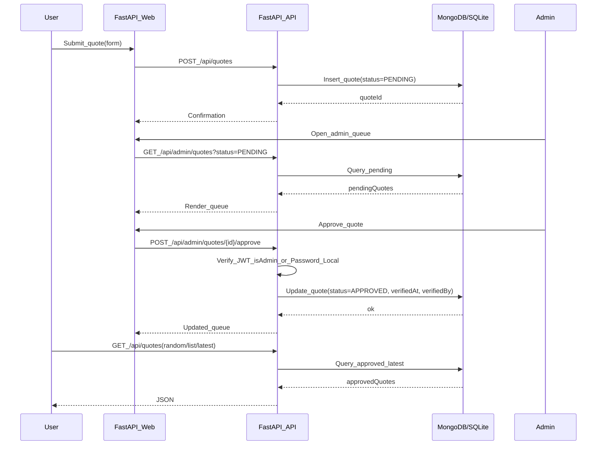

# Dan Quotes Service (FastAPI + MongoDB/SQLite)

## Architecture

- **Backend**: FastAPI (Python) with server-rendered pages (Jinja2) + JSON API.
- **Database**: MongoDB Atlas (prod) or SQLite (local).
- **Auth**: JWT (JWKS) for admin-only actions; password in local mode.

## Data model (Mongo/SQLite)

- **Collection/Table**: `quotes`
  - `id` (string/uuid)
  - `content` (string)
  - `content_hash` (string; dedupe, unique index)
  - `status` (enum: `PENDING` | `APPROVED` | `REJECTED`)
  - `source` (string; e.g. `records.txt` or `web_submit`)
  - `created_at` (timestamp)
  - `submitted_by` (string; optional)
  - `verified_at` (timestamp, nullable)
  - `verified_by` (string, nullable)

## Backend features

- **Public web pages**
  - `/` list approved quotes (pagination)
  - `/random` show one random approved quote
  - `/submit` form to submit a new quote
- **Admin web pages (JWT-authenticated or password in local)**
  - `/admin` pending queue (approve/reject)

## API surface

- **Public**
  - `GET /api/quotes` (list approved; `limit`, `cursor`)
  - `GET /api/quotes/random`
  - `GET /api/quotes/latest` (most recent, optional `status`)
  - `GET /api/quotes/{id}` (approved only)
  - `POST /api/quotes` (create pending)
- **Admin (requires JWT + isAdmin; password in local)**
  - `GET /api/admin/quotes?status=PENDING`
  - `POST /api/admin/quotes/{id}/approve`
  - `POST /api/admin/quotes/{id}/reject`

## Auth + admin check

- Accept `Authorization: Bearer <jwt>` on admin routes.
- Verify token using JWKS URL (`INSTANTDB_JWKS_URL` / `INSTANTDB_TOKEN_VERIFY_URL`).
- Determine admin via allowlist `ADMIN_EMAILS`.
- Local mode: password-only using `ADMIN_PASSWORD`.

## Initial import (seed from records.txt)

- Script [`scripts/import_records.py`](scripts/import_records.py):
  - Parses numbered bullet lines in [`records.txt`](records.txt).
  - Normalizes whitespace, computes `content_hash`.
  - Inserts into Mongo/SQLite as `APPROVED` with `source=records.txt`.
  - Skips duplicates by `content_hash`.

## Project structure

- [`app/main.py`](app/main.py) FastAPI app, routers, template wiring.
- [`app/mongostore.py`](app/mongostore.py) Mongo client wrapper (CRUD + query helpers).
- [`app/auth.py`](app/auth.py) JWT verification + `is_admin()`.
- [`app/models.py`](app/models.py) Pydantic request/response models.
- [`app/templates/`](app/templates/) Jinja2 templates for pages.
- [`app/static/`](app/static/) CSS and assets.
- [`scripts/import_records.py`](scripts/import_records.py) seed importer.
- [`requirements.txt`](requirements.txt) pinned deps (fastapi, uvicorn, jinja2, motor, httpx, python-dotenv).
- [`README.md`](README.md) setup, env vars, run + import steps.

## Configuration (env vars)

- `MONGODB_URI`, `MONGODB_DB`, `MONGODB_COLLECTION`
- `LOCAL_MODE`, `LOCAL_DB_PATH`, `ADMIN_PASSWORD` (local)
- `INSTANTDB_JWKS_URL` or `INSTANTDB_TOKEN_VERIFY_URL` (JWKS for JWT verify)
- `ADMIN_EMAILS`

## Acceptance criteria

- Can submit a quote → lands as **PENDING**.
- Admin can view queue and **APPROVE/REJECT**.
- Only **APPROVED** quotes appear on `/`, `/random`, `/api/quotes`, and `/api/quotes/{id}`.
- `/api/quotes/latest` returns the most recently inserted quote (optional status filter).
- One command/script imports the existing `records.txt` quotes into Mongo/SQLite as **APPROVED**.